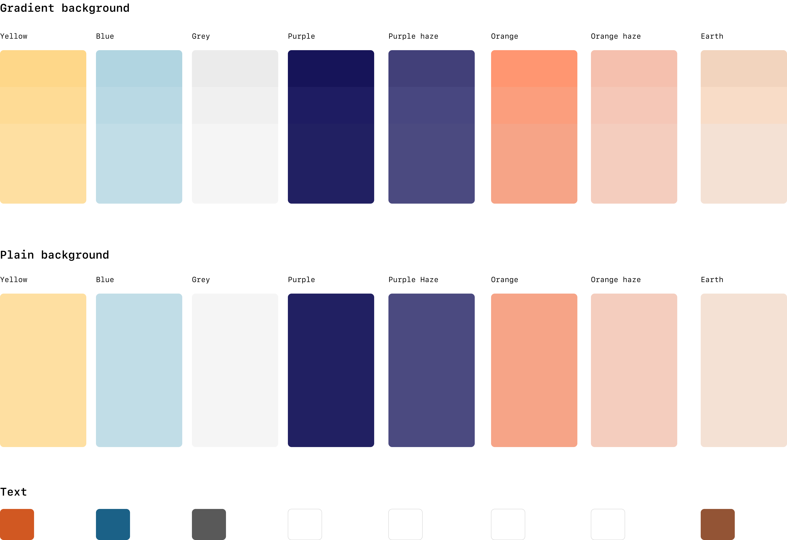

# What's with the weather?

What's with the weather is a tiny weather app I made whilst learning React. 

See it in action -> [whats-with-the-weather.netlify.app](http://whats-with-the-weather.netlify.app/)

### In a nutshell: 
- Gets the users location coordinates using geolocation from the [Navigator Web API](https://developer.mozilla.org/en-US/docs/Web/API/Navigator).
- Uses those coordinates to fetch the weather from the [Open Weather API](https://openweathermap.org/api). It does this via a [Netlify function](https://www.netlify.com/products/functions/) to hide the API app id.
- Uses the weather response to generate a graphic from different combinations of react components based on the weather ID. The data for each graphic is stored in a hardcoded array of objects.
- Renders the graphic, location, temperature and weather description. 

### A bit more detail: 

